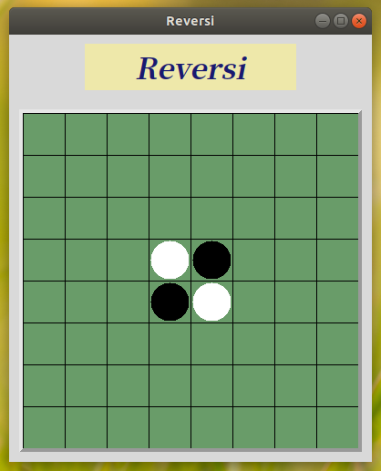
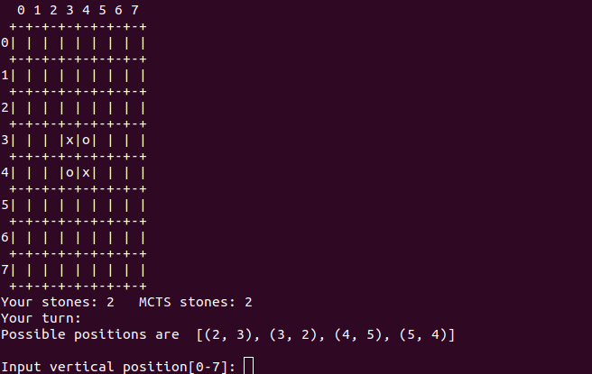

# MCTSReversi - Reversi program utilizing Monte Carlo tree search (MCTS)

## Algorithm

This program use Monte Carlo tree search (MCTS) for the computer player.
The player only use the algorithm and does not use other strategies such as evaluation functions for evaluating a board.

## Usage

It has GUI mode and CUI mode.

To run GUI mode, open ReversiUI.py with Python3 as follows.
```
$ python3 src/ReversiUI.py 
```
 


To run CUI mode, open mcts_reversi.py with Python3 as follows.
```
$ python3 src/mcts_reversi.py 
```

 


The game proceeds as follows.
```
$ python3 src/mcts_reversi.py 
  0 1 2 3 4 5 6 7 
 +-+-+-+-+-+-+-+-+
0| | | | | | | | |
 +-+-+-+-+-+-+-+-+
1| | | | | | | | |
 +-+-+-+-+-+-+-+-+
2| | | | | | | | |
 +-+-+-+-+-+-+-+-+
3| | | |x|o| | | |
 +-+-+-+-+-+-+-+-+
4| | | |o|x| | | |
 +-+-+-+-+-+-+-+-+
5| | | | | | | | |
 +-+-+-+-+-+-+-+-+
6| | | | | | | | |
 +-+-+-+-+-+-+-+-+
7| | | | | | | | |
 +-+-+-+-+-+-+-+-+
Your stones: 2   MCTS stones: 2
Your turn:  
Possible positions are  [(2, 3), (3, 2), (4, 5), (5, 4)]

Input vertical position[0-7]: 2
Input horizontal position[0-7]: 3
Your input : ( 2 , 3 )
  0 1 2 3 4 5 6 7 
 +-+-+-+-+-+-+-+-+
0| | | | | | | | |
 +-+-+-+-+-+-+-+-+
1| | | | | | | | |
 +-+-+-+-+-+-+-+-+
2| | | |o| | | | |
 +-+-+-+-+-+-+-+-+
3| | | |o|o| | | |
 +-+-+-+-+-+-+-+-+
4| | | |o|x| | | |
 +-+-+-+-+-+-+-+-+
5| | | | | | | | |
 +-+-+-+-+-+-+-+-+
6| | | | | | | | |
 +-+-+-+-+-+-+-+-+
7| | | | | | | | |
 +-+-+-+-+-+-+-+-+
Your stones: 4   MCTS stones: 1
MCTS's turn:  
loop: 500 [(2, 4), (2, 5), (4, 2), (5, 5), (1, 5), (0, 5), (2, 2), (5, 2), (6, 6), (4, 5), (5, 4), (1, 3), (1, 6), (0, 7)] 14  eval val:  True
loop count:  969
MCTS's answer:  (2, 4)
  0 1 2 3 4 5 6 7 
 +-+-+-+-+-+-+-+-+
0| | | | | | | | |
 +-+-+-+-+-+-+-+-+
1| | | | | | | | |
 +-+-+-+-+-+-+-+-+
2| | | |o|x| | | |
 +-+-+-+-+-+-+-+-+
3| | | |o|x| | | |
 +-+-+-+-+-+-+-+-+
4| | | |o|x| | | |
 +-+-+-+-+-+-+-+-+
5| | | | | | | | |
 +-+-+-+-+-+-+-+-+
6| | | | | | | | |
 +-+-+-+-+-+-+-+-+
7| | | | | | | | |
 +-+-+-+-+-+-+-+-+
Your stones: 3   MCTS stones: 3

....
```

